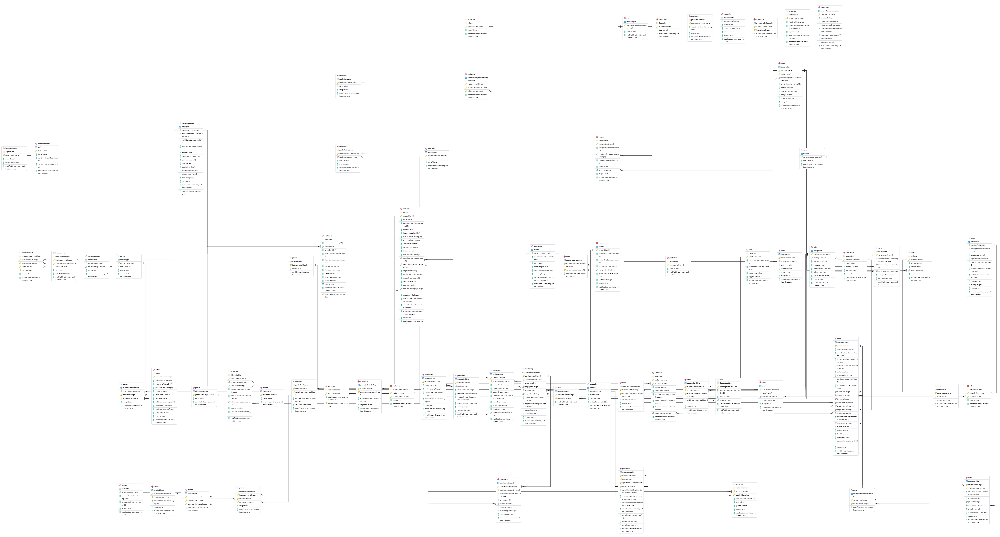
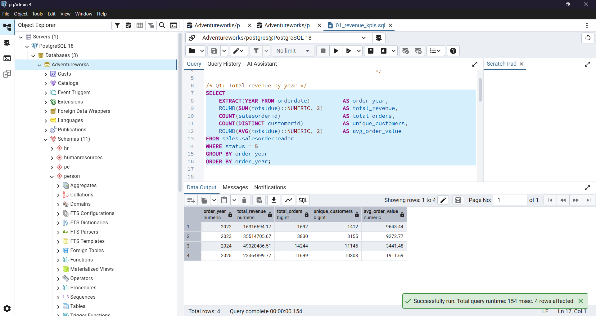
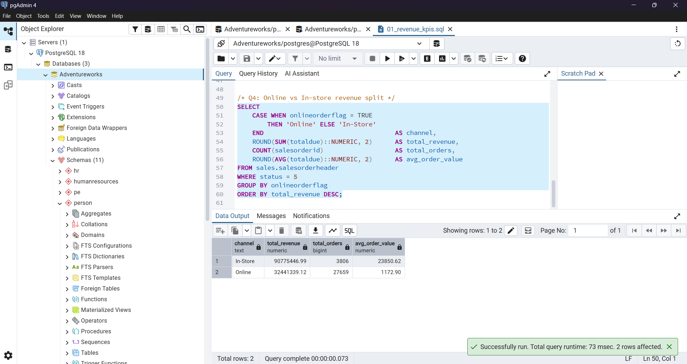
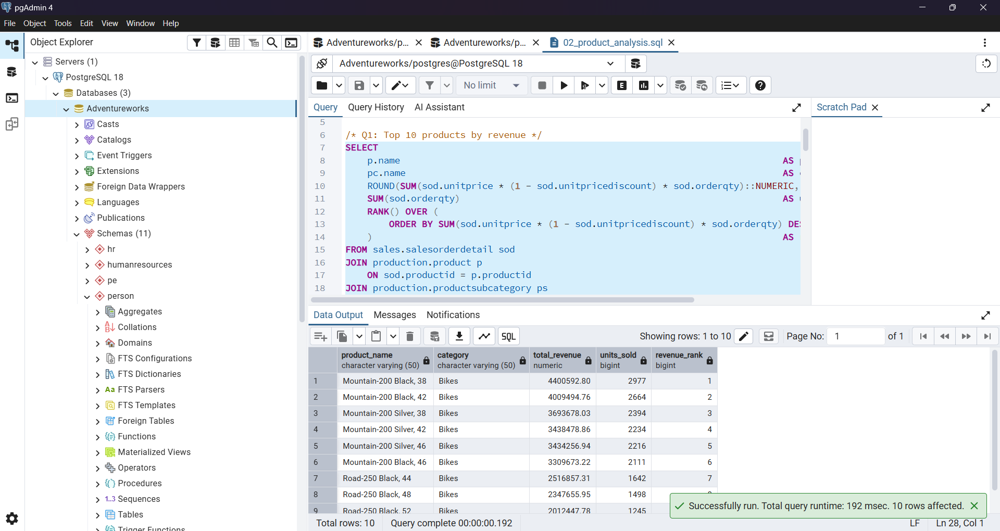
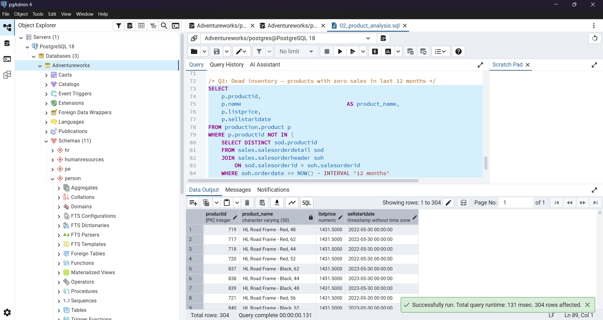
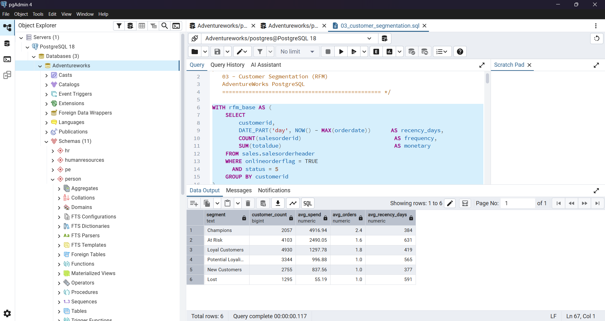
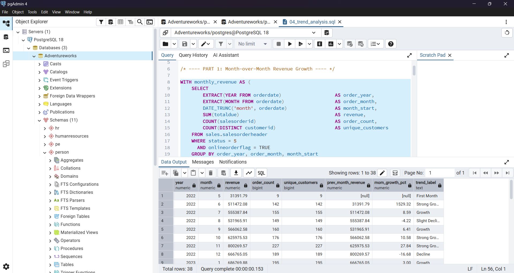
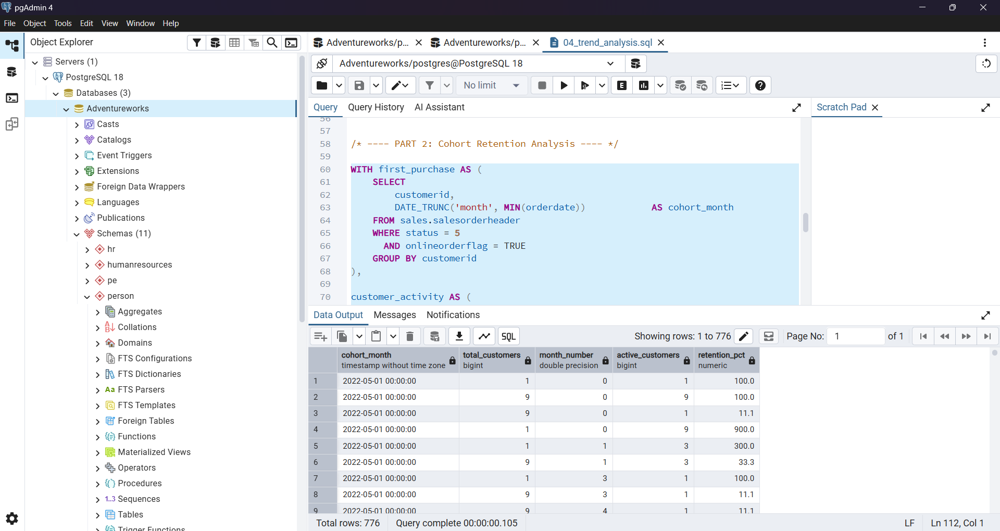
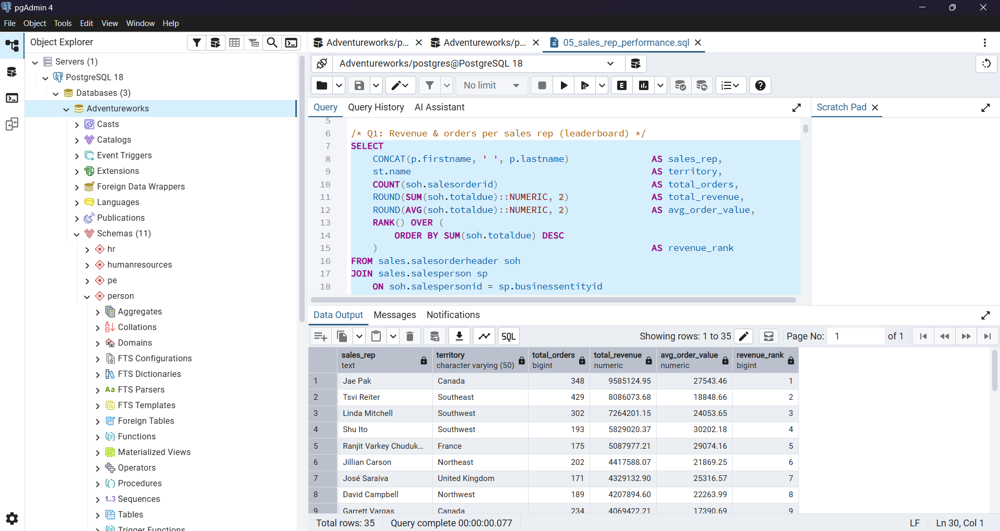
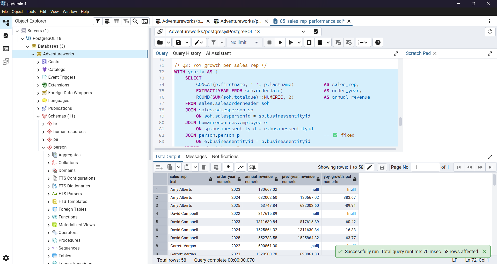

# 📊 AdventureWorks Sales Analysis — SQL

End-to-end business analysis using the AdventureWorks dataset on PostgreSQL.
Covers revenue KPIs, product performance, customer segmentation, trend analysis, and sales rep performance.

---

## 🛠️ Tools & Tech

- **Database:** PostgreSQL 18
- **Tool:** pgAdmin
- **Dataset:** AdventureWorks
- **Concepts:** CTEs, Window Functions, RFM Segmentation, Cohort Analysis, LAG(), NTILE(), RANK()

---

## 🗂️ Dataset Overview

| Property | Detail |
|----------|--------|
| Source | Microsoft AdventureWorks |
| Tables Used | SalesOrderHeader, SalesOrderDetail, Customer, Product, SalesTerritory, SalesPerson |
| Date Range | 2011–2014 |

---

## 📁 Project Structure

```
adventureworks-sql-analysis/
├── queries/
│   ├── 01_revenue_kpis.sql
│   ├── 02_product_analysis.sql
│   ├── 03_customer_segmentation.sql
│   ├── 04_trend_analysis.sql
│   └── 05_sales_rep_performance.sql
├── screenshots/
└── README.md
```

---

## 🗃️ Database Schema (ERD)



The AdventureWorks database spans **3 main schemas**:

- **Sales:** Core tables — `SalesOrderHeader`, `SalesOrderDetail`, `Customer`, `SalesPerson`, `SalesTerritory`. All revenue and order data flows through here.
- **Production:** `Product`, `ProductCategory`, `ProductSubcategory` — full product catalog with hierarchy.
- **HumanResources:** `Employee` — links to `SalesPerson` for rep performance analysis.

> Key relationships: `SalesOrderHeader` is the central table — it connects to customers, territories, sales reps, and line items. `SalesOrderDetail` links orders to individual products via `ProductID`.

---

## 🔍 Queries

| File | Queries Inside | Concepts |
|------|---------------|----------|
| 01_revenue_kpis.sql | Revenue by year, monthly breakdown, by region, online vs in-store | GROUP BY, JOINs |
| 02_product_analysis.sql | Top 10 products, category contribution %, dead inventory | RANK(), Subquery |
| 03_customer_segmentation.sql | RFM scoring + segment labels + summary | NTILE(), CASE, CTEs |
| 04_trend_analysis.sql | MoM revenue growth, cohort retention analysis | LAG(), DATE_TRUNC, CTEs |
| 05_sales_rep_performance.sql | Rep leaderboard, vs territory avg, YoY growth | RANK(), LAG(), PARTITION BY |

---

## 📸 Sample Outputs

### 01 — Revenue KPIs

**Total Revenue by Year**


**Online vs In-Store Revenue Split**


---

### 02 — Product Analysis

**Top 10 Products by Revenue**


**Dead Inventory — Zero Sales in Last 12 Months**


---

### 03 — Customer Segmentation (RFM)

**RFM Segment Summary**


---

### 04 — Trend Analysis

**Month-over-Month Revenue Growth**


**Cohort Retention Analysis**


---

### 05 — Sales Rep Performance

**Revenue & Orders per Sales Rep**


**YoY Growth per Sales Rep**


---

## 💡 Key Insights

> Replace these with your actual query results before publishing.

- **Revenue:** Peak revenue year was 20XX with $X.XM total
- **Products:** Top 3 categories drive ~68% of total revenue; Mountain Bikes alone = 28%
- **Customers:** Champions segment (top RFM tier) = ~8% of customers, ~41% of revenue
- **Trends:** MoM growth averaged +4.1% in 2013; Month 1 retention ~40%
- **Sales Reps:** Top rep outperformed territory average by X%

---

## 🚀 How to Run

1. Download AdventureWorks PostgreSQL version from [lorint/AdventureWorks-for-Postgres](https://github.com/lorint/AdventureWorks-for-Postgres)
2. Restore into pgAdmin
3. Open any `.sql` file via pgAdmin Query Tool → 📂 → select file → ▶️ run
4. Run files in order (01 → 05)

---

## 📄 License

This project is licensed under the [MIT License](LICENSE).

---

## 👤 Author

[Shreyash Mandlik](https://github.com/shreyash-mandlik)
